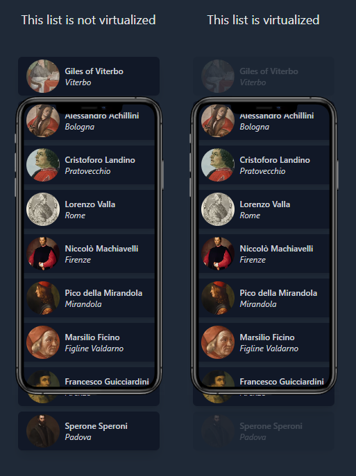

<div align="center">
  
</div>

# VirtualizedList Component

A high-performance virtualized list component built with `@tanstack/react-virtual` that efficiently
renders large lists by only rendering visible items.

## Features

- ✨ **Virtual scrolling** - Only renders visible items for optimal performance
- 🔄 **Infinite scrolling** - Load more data as user scrolls
- ⏳ **Loading states** - Handles initial load and load-more states
- 📭 **Empty state** - Shows customizable empty message when no data
- 🎨 **Fully customizable** - Custom rendering, styling, and behavior
- 🔑 **Flexible keys** - Support for custom item keys

## Basic Usage

```tsx
import VirtualizedList from '@atom/virtualized-list';

interface Item {
  id: string;
  name: string;
}

function MyComponent() {
  const data: Item[] = [
    { id: '1', name: 'Item 1' },
    { id: '2', name: 'Item 2' }
    // ... more items
  ];

  return (
    <VirtualizedList
      data={data}
      renderItem={item => <div className="p-4 border-b">{item.name}</div>}
      getItemKey={item => item.id}
      emptyMessage={<div>No items found</div>}
    />
  );
}
```

## Props

| Prop                 | Type                                           | Default            | Description                                           |
| -------------------- | ---------------------------------------------- | ------------------ | ----------------------------------------------------- |
| `data`               | `T[]`                                          | Required           | Array of items to render                              |
| `renderItem`         | `(item: T, index: number) => React.ReactNode`  | Required           | Function to render each item                          |
| `estimateSize`       | `number`                                       | `50`               | Estimated size of each item in pixels                 |
| `overscan`           | `number`                                       | `5`                | Number of items to render outside visible area        |
| `hasMore`            | `boolean`                                      | `false`            | Whether there are more items to load                  |
| `onLoadMore`         | `() => void`                                   | `undefined`        | Callback fired when user scrolls near bottom          |
| `threshold`          | `number`                                       | `100`              | Distance from bottom (in pixels) to trigger load more |
| `emptyMessage`       | `React.ReactNode`                              | `<NoDataFound />`  | Content to show when list is empty                    |
| `loader`             | `React.ReactNode`                              | `<LoaderCircle />` | Loading indicator component                           |
| `isLoading`          | `boolean`                                      | `false`            | Whether data is currently loading                     |
| `containerClassName` | `string`                                       | `undefined`        | CSS class for the scroll container                    |
| `height`             | `string \| number`                             | `'40vh'`           | Height of the list container                          |
| `getItemKey`         | `(item: T, index: number) => string \| number` | `undefined`        | Function to get unique key for each item              |
| `className`          | `string`                                       | `undefined`        | CSS class for each item wrapper                       |

## Examples

### With Infinite Scrolling

```tsx
function InfiniteList() {
  const [items, setItems] = useState<Item[]>([]);
  const [hasMore, setHasMore] = useState(true);
  const [isLoading, setIsLoading] = useState(false);

  const loadMore = async () => {
    setIsLoading(true);
    // Fetch more data from API
    const newItems = await fetchItems();
    setItems(prev => [...prev, ...newItems]);
    setHasMore(newItems.length > 0);
    setIsLoading(false);
  };

  return (
    <VirtualizedList
      data={items}
      renderItem={item => <ItemCard item={item} />}
      hasMore={hasMore}
      onLoadMore={loadMore}
      isLoading={isLoading}
      threshold={200}
      getItemKey={item => item.id}
    />
  );
}
```

### Custom Styling

```tsx
<VirtualizedList
  data={items}
  renderItem={item => <CustomCard item={item} />}
  height="600px"
  containerClassName="rounded-lg border border-gray-200"
  className="hover:bg-gray-50 transition-colors"
  estimateSize={100}
  overscan={10}
  getItemKey={item => item.id}
/>
```

### With Custom Empty State and Loader

```tsx
<VirtualizedList
  data={items}
  renderItem={item => <div>{item.name}</div>}
  isLoading={isLoading}
  loader={
    <div className="flex justify-center py-8">
      <Spinner size="large" />
    </div>
  }
  emptyMessage={
    <div className="text-center py-12">
      <EmptyIcon />
      <h3>No items yet</h3>
      <p>Add your first item to get started</p>
    </div>
  }
  getItemKey={item => item.id}
/>
```

### Variable Height Items

For items with different heights, the component automatically measures them. Make sure to use
`rowVirtualizer.measureElement`:

```tsx
<VirtualizedList
  data={items}
  renderItem={item => (
    <div className="p-4">
      <h3>{item.title}</h3>
      <p>{item.description}</p>
      {/* Content with varying heights */}
    </div>
  )}
  estimateSize={80} // Average estimate
  getItemKey={item => item.id}
/>
```

## Performance Tips

1. **Use `getItemKey`**: Always provide a unique key function for better React reconciliation
2. **Adjust `estimateSize`**: Set it close to your average item height for better performance
3. **Tune `overscan`**: Increase for smoother scrolling, decrease for better performance
4. **Memoize `renderItem`**: Use `useCallback` to avoid unnecessary re-renders

```tsx
const renderItem = useCallback((item: Item) => <ItemCard item={item} />, []);
```

## Browser Support

Works in all modern browsers that support:

- React 18+
- ES6+
- IntersectionObserver (for scroll detection)

## TypeScript

The component is fully typed and supports generic types:

```tsx
interface MyItem {
  id: string;
  name: string;
  value: number;
}

<VirtualizedList<MyItem>
  data={items}
  renderItem={item => {
    // item is properly typed as MyItem
    return <div>{item.name}</div>;
  }}
  getItemKey={item => item.id}
/>;
```

